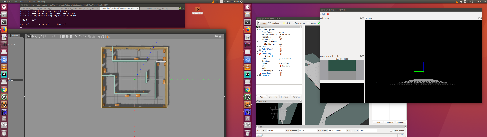
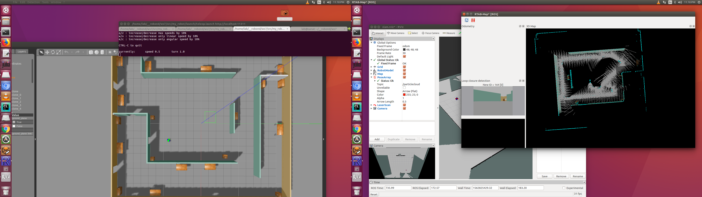
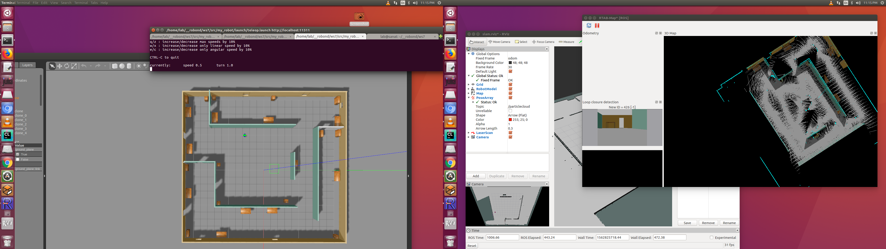
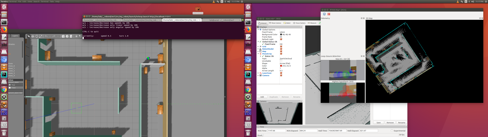

[](https://www.udacity.com/robotics)

#  Map my world
## Project Overview

 In this project we will create a 2D occupancy grid and 3D octomap from a simulated
 environment using our own robot with the RTAB-Map package 

    RTAB-Map (Real-Time Appearance-Based Mapping) is a popular solution for SLAM to develop robots 
    that can map environments in 3D. RTAB-Map has good speed and memory management, 
    and it provides custom developed tools for information analysis. Most importantly, 
    the quality of the documentation on ROS Wiki (http://wiki.ros.org/rtabmap_ros) is very high.
    Being able to leverage RTAB-Map with your own robots will lead to a solid foundation for mapping
    and localization well beyond this Nanodegree program.
    
    For this project we will be using the rtabmap_ros package, which is a ROS wrapper (API) for interacting
    with RTAB-Map. Keep this in mind when looking at the relative documentation.
    
    The robot will also be used as a base model for all your upcoming projects in this Robotics Software
    Engineer Nanodegree Program. 


 The directory structure and contain all the files listed here:

    .ws4                          # where am I
     ├── src
     │  ├── my_robot                       # my_robot package                   
     │  │   ├── config                     # amc config pointcloud   
     │  │   │   ├── base_local_planner_params.yaml
     │  │   │   ├── costmap_common_params.yaml
     │  │   │   ├── global_costmap_params.yaml
     │  │   │   ├── local_costmap_params.yaml
     │  │   │   ├── rviz.rviz
     │  │   ├── launch                     # launch folder for launch files   
     │  │   │   ├── amcl.launch
     │  │   │   ├── mapping.launch
     │  │   │   ├── localization.launch
     │  │   │   ├── teleop.launch
     │  │   │   ├── robot_description.launch
     │  │   │   ├── world.launch
     │  │   ├── maps                     # map   
     │  │   │   ├── map.pgm
     │  │   │   ├── map.yaml
     │  │   │   ├── new_office_world_map.pgm
     │  │   │   ├── new_office_world_map.yaml
     │  │   │   ├── newofficeworld.pgm
     │  │   │   ├── newofficeworld.yaml
     │  │   │   ├── udacity_map.pgm
     │  │   │   ├── udacity_map.yaml
     │  │   │   ├── worldoffice2.pgm
     │  │   │   ├── worldoffice2.yaml
     │  │   │   ├── worldoffice_map1.pgm
     │  │   ├── src                        # source folder for C++ scripts
     │  │   │   ├── navigation_goal.cpp
     │  │   ├── meshes                     # meshes folder for sensors
     │  │   │   ├── hokuyo.dae
     │  │   ├── urdf                       # urdf folder for xarco files
     │  │   │   ├── my_robot.gazebo
     │  │   │   ├── my_robot.xacro
     │  │   ├── world                      # world folder for world files
     │  │   │   ├── empty.world
     │  │   │   ├── myoffice.world
     │  │   │   ├── new_office_world
     │  │   │   ├── newofficeworld.world
     │  │   │   ├── office_pnd.world
     │  │   │   ├── worldoffice
     │  │   │   ├── worldoffice2
     │  │   ├── CMakeLists.txt             # compiler instructions
     │  │   ├── package.xml                # package info
     │  ├── ball_chaser                    # ball_chaser package                   
     │  │   ├── launch                     # launch folder for launch files   
     │  │   │   ├── ball_chaser.launch
     │  │   ├── src                        # source folder for C++ scripts
     │  │   │   ├── drive_bot.cpp
     │  │   │   ├── process_images.cpp
     │  │   ├── srv                        # service folder for ROS services
     │  │   │   ├── DriveToTarget.srv
     │  │   ├── CMakeLists.txt             # compiler instructions
     │  │   ├── package.xml                # package info                  
     │  └──                              
     ├── my_ball                            # white ball
     │  └──   model.config
     │  └──   model.sdf
     ├── office_new_vertical                # office_new_vertical
     │  └──   model.config
     │  └──   model.sdf
     ├── better_office                      # better_office
     │  └──   model.config
     │  └──   model.sdf
     ├── office_pnd                         # office_pnd
     │  └──   model.config
     │  └──   model.sdf
     │  
     ├── images                            # results screen shots
     ├── rtab_db                            # results screen shots
     │  
     
      
     
     
     
## Contents
 

Note that some example snapshots of the robot simulator can be found inside the folder **images/**.

## Usage 

#### Step 1 

launch simulator. 
```
$ roslaunch my_robot world.launch
```
#### Step 2

Launch rtabmap.

```
$  roslaunch my_robot mapping.launch
```
#### Step 3

Launch teleop.

```
$  roslaunch my_robot teleop.launch

or

$  rosrun teleop_twist_keyboard teleop_twist_keyboard.py

```
##  
#### rtab mapping with 'teleop'


 

 

 

 
 

